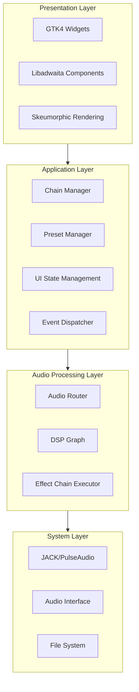
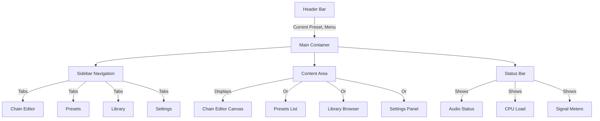
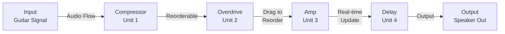
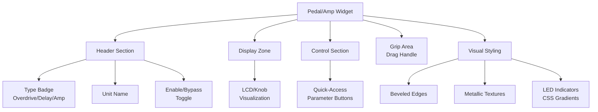
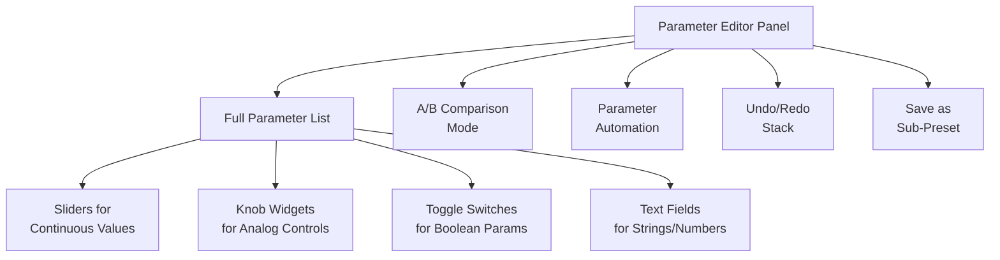
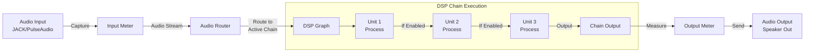
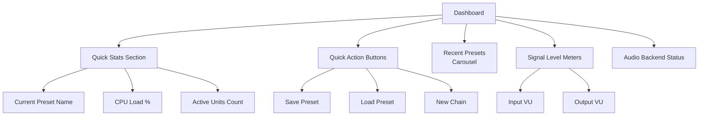
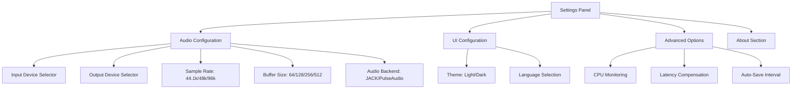

# AmpChain: Digital Guitar Amp & Pedal Simulator
## Software Design Specification v1.0

**June 2026**

---

## Table of Contents

1. [Introduction](#introduction)
2. [System Overview](#system-overview)
3. [Architecture & Technical Stack](#architecture--technical-stack)
4. [User Interface Design](#user-interface-design)
5. [Core Features](#core-features)
6. [Data Structures & File Format](#data-structures--file-format)
7. [Audio Processing Pipeline](#audio-processing-pipeline)
8. [Audio Engine Integration](#audio-engine-integration)
9. [User Interface Components](#user-interface-components)
10. [Settings & Persistence](#settings--persistence)
11. [Implementation Considerations](#implementation-considerations)
12. [Testing & Quality Assurance](#testing--quality-assurance)
13. [Glossary](#glossary)

---

## Introduction

**AmpChain** is a GTK4/libadwaita-based desktop application for simulating guitar amplifiers and effects pedals. It provides musicians and producers with a flexible, hardware-agnostic platform for audio signal processing that integrates with professional audio interfaces.

### Purpose

AmpChain enables users to:

- Process guitar audio through chain-able amplifier and effects simulations
- Arrange amplifiers and pedals in custom signal chains via drag-and-drop interaction
- Save and load complete rig configurations as presets
- Browse and experiment with a library of generic amp and pedal simulations
- Integrate seamlessly with JACK, PulseAudio, or other audio backends available on Linux

### Scope

This specification covers the complete design and implementation of AmpChain, including audio processing architecture, user interface design, data persistence, and integration points with system audio infrastructure. It does not include the implementation of specific amp or pedal simulations (which are pluggable DSP modules) or the development of the underlying audio engine, which is assumed to be handled by a separate audio processing library or framework.

---

## System Overview

### High-Level Architecture

AmpChain follows a modular, layered architecture with clear separation of concerns:



### Key Components

| Component | Responsibility |
|-----------|-----------------|
| **Chain Editor** | Interactive canvas for arranging amp and pedal units |
| **Preset Manager** | Save, load, and organize signal chains |
| **Library Browser** | Discover and add available amps and effects |
| **Settings Panel** | Configure audio input/output, UI preferences |
| **Audio Router** | Manages signal flow and DSP graph connections |
| **Persistence Layer** | Handles configuration files in JSON/YAML |

---

## Architecture & Technical Stack

### Technology Stack

| Component | Technology |
|-----------|-----------|
| **Language** | Kotlin 1.9+ |
| **Runtime** | JVM 17+ or GraalVM Native Image |
| **UI Framework** | GTK4 via JGIR (Java GObject Introspection Repository bindings) |
| **Audio I/O** | JACK with fallback to PulseAudio/ALSA |
| **DSP Engine** | LV2 plugin host or custom modular architecture |
| **Data Format** | JSON (Kotlinx Serialization) or YAML (yamikt) |
| **Build System** | Gradle (Kotlin DSL) |
| **Async Runtime** | Kotlin Coroutines with Dispatchers |
| **Testing** | Kotest, Mockk, TestFX |
| **Logging** | KotlinLogging (SLF4J abstraction) |

### Platform Target

- **Primary:** Linux (GNOME 45+, KDE Plasma 6+)
- **Secondary:** macOS and Windows via GTK4 cross-platform support (scope dependent)

### Project Structure

```
ampchain/
├── src/main/kotlin/com/ampchain/
│   ├── app/
│   │   └── AmpChainApplication.kt
│   ├── ui/
│   │   ├── views/
│   │   │   ├── ChainEditorView.kt
│   │   │   ├── PresetsView.kt
│   │   │   ├── LibraryView.kt
│   │   │   └── SettingsView.kt
│   │   ├── components/
│   │   │   ├── PedalWidget.kt
│   │   │   ├── AmpWidget.kt
│   │   │   ├── ChainCanvas.kt
│   │   │   └── ParameterEditor.kt
│   │   └── events/
│   │       └── UIEventBus.kt
│   ├── model/
│   │   ├── Chain.kt
│   │   ├── Unit.kt
│   │   ├── Preset.kt
│   │   └── Parameter.kt
│   ├── audio/
│   │   ├── AudioEngine.kt
│   │   ├── AudioRouter.kt
│   │   ├── DSPModule.kt
│   │   └── JackClient.kt
│   ├── persistence/
│   │   ├── PresetRepository.kt
│   │   ├── ConfigManager.kt
│   │   └── serialization/
│   │       ├── PresetDeserializer.kt
│   │       └── PresetSerializer.kt
│   └── utils/
│       ├── AudioUtils.kt
│       └── FileUtils.kt
├── src/main/resources/
│   ├── gtkbuilder/
│   │   └── mainwindow.ui
│   └── config/
│       └── default.conf
├── src/test/kotlin/
└── build.gradle.kts
```

---

## User Interface Design

### Design Philosophy

AmpChain employs skeumorphism to create a tactile, familiar interface inspired by physical guitar equipment. The design balances realism with modern UI best practices:

- Visual metaphors evoke physical amp stacks and pedalboards without mimicking proprietary designs
- Interactive elements feel responsive and satisfying to manipulate
- Dark theme optimizes for long studio sessions and reduces eye strain
- Consistent use of libadwaita components ensures native OS integration

### Main Window Layout



### Chain Editor Canvas

The Chain Editor is the heart of the application. It presents a vertical signal flow visualization:



**Features:**
- Audio flows top to bottom in a linear chain
- Each unit is rendered as a skeumorphic widget with visual depth
- Units display controls: name, model, enable/bypass toggle, parameter buttons
- Drag-and-drop reordering updates audio graph in real-time
- Right-click context menus for unit-specific actions
- Visual indicators for bypassed units, clipping, processing status

### Skeumorphic Unit Widget

Each amp or pedal unit widget features:



---

## Core Features

### 5.1 Signal Chain Management

- Add units from library to active chain
- Remove units from chain
- Reorder units via drag-and-drop
- Enable/disable (bypass) individual units
- Duplicate units for parallel processing paths
- Clear entire chain and start fresh
- Undo/redo for chain modifications

### 5.2 Preset Management

- Save current chain and parameters as named preset
- Load presets from disk with crossfade transition
- List all presets with metadata (date, modification time, tags)
- Quick-switch between presets
- Rename and delete presets
- Tag presets for organization (#clean, #metal, #ambient)
- Export/import presets for sharing
- Preset versioning and history

### 5.3 Library Browser

- Categorized listing of available amp simulators and effects
- Search and filter by category, type, or name
- Preview unit parameters before adding
- Drag units from library to chain canvas
- View detailed specs: latency, CPU load, parameter count
- Tag system for custom organization
- Favorite/star units for quick access

### 5.4 Unit Parameter Editor

When a user clicks a unit, a detailed editor panel opens:



---

## Data Structures & File Format

### Preset File Format (JSON)

Presets are stored as JSON files with the following structure:

```json
{
  "version": "1.0",
  "metadata": {
    "name": "Heavy Metal Lead",
    "description": "High-gain chain for metal tones",
    "created": "2026-06-10T14:23:00Z",
    "modified": "2026-06-11T09:15:00Z",
    "tags": ["metal", "lead", "high-gain"],
    "author": "Optional Author Name"
  },
  "chain": [
    {
      "id": "unit_001",
      "type": "compressor",
      "model": "Generic Compressor",
      "enabled": true,
      "parameters": {
        "ratio": 4.0,
        "threshold": -20.0,
        "makeup_gain": 6.0,
        "attack": 10.0,
        "release": 100.0
      }
    },
    {
      "id": "unit_002",
      "type": "overdrive",
      "model": "Generic Overdrive",
      "enabled": true,
      "parameters": {
        "drive": 0.75,
        "tone": 0.6,
        "level": 0.8
      }
    },
    {
      "id": "unit_003",
      "type": "amp",
      "model": "Generic Stack",
      "enabled": true,
      "parameters": {
        "preamp_gain": 0.9,
        "bass": 0.7,
        "mid": 0.5,
        "treble": 0.8,
        "master": 0.6
      }
    }
  ]
}
```

### Kotlin Data Classes & Domain Models

```kotlin
// Preset.kt
import kotlinx.serialization.Serializable
import kotlinx.datetime.Instant

@Serializable
data class PresetMetadata(
    val name: String,
    val description: String = "",
    val created: Instant = Instant.now(),
    val modified: Instant = Instant.now(),
    val tags: List<String> = emptyList(),
    val author: String? = null
)

@Serializable
data class Parameter(
    val name: String,
    val value: Float,
    val min: Float = 0f,
    val max: Float = 1f,
    val step: Float = 0.01f
) {
    fun clamp(): Parameter = copy(
        value = value.coerceIn(min, max)
    )
}

@Serializable
data class Unit(
    val id: String,
    val type: String, // "amp", "overdrive", "delay", etc.
    val model: String,
    val enabled: Boolean = true,
    val parameters: Map<String, Float> = emptyMap()
) {
    fun getParameter(name: String): Float = parameters[name] ?: 0f
    
    fun setParameter(name: String, value: Float): Unit = 
        copy(parameters = parameters + (name to value))
    
    fun bypass(): Unit = copy(enabled = false)
    fun resume(): Unit = copy(enabled = true)
}

@Serializable
data class Chain(
    val units: List<Unit> = emptyList()
) {
    fun isEmpty(): Boolean = units.isEmpty()
    
    fun moveUnit(fromIndex: Int, toIndex: Int): Chain {
        if (fromIndex !in units.indices || toIndex !in units.indices) {
            return this
        }
        return units.toMutableList()
            .apply { add(toIndex, removeAt(fromIndex)) }
            .let { copy(units = it) }
    }
    
    fun addUnit(unit: Unit, index: Int = units.size): Chain =
        copy(units = units.toMutableList().apply { add(index, unit) })
    
    fun removeUnit(unitId: String): Chain =
        copy(units = units.filterNot { it.id == unitId })
    
    fun updateUnit(unitId: String, block: Unit.() -> Unit): Chain =
        copy(units = units.map { if (it.id == unitId) it.apply(block) else it })
    
    fun enabledUnits(): List<Unit> = units.filter { it.enabled }
}

@Serializable
data class Preset(
    val version: String = "1.0",
    val metadata: PresetMetadata,
    val chain: Chain
) {
    companion object {
        fun create(
            name: String,
            description: String = "",
            units: List<Unit> = emptyList(),
            author: String? = null
        ) = Preset(
            metadata = PresetMetadata(
                name = name,
                description = description,
                author = author
            ),
            chain = Chain(units)
        )
    }
    
    fun withUpdatedChain(block: Chain.() -> Chain): Preset =
        copy(chain = chain.block(), metadata = metadata.copy(modified = Instant.now()))
}

// Type aliases for readability
typealias UnitId = String
typealias PresetName = String
typealias ParameterValue = Float
```

### Application Configuration

User settings stored in `~/.config/ampchain/config.json`:

```json
{
  "audio": {
    "input_device": "system:capture_1",
    "output_device": "system:playback_1",
    "sample_rate": 44100,
    "buffer_size": 256,
    "backend": "jack"
  },
  "ui": {
    "theme": "dark",
    "window_width": 1400,
    "window_height": 900,
    "window_maximized": false,
    "sidebar_collapsed": false
  },
  "presets": {
    "default_preset": "Clean Tone",
    "recent": ["Heavy Metal Lead", "Jazz Ambient", "Clean Tone"],
    "last_opened": "2026-06-11T15:30:00Z"
  },
  "advanced": {
    "enable_cpu_monitoring": true,
    "latency_compensation": true,
    "auto_save_interval_seconds": 30
  }
}
```

---

## Audio Processing Pipeline

### Signal Flow Architecture



### Real-Time Constraints

- All DSP operations must be lock-free or use minimal locking to prevent audio glitches
- Chain reordering and parameter changes queued and applied on audio block boundaries
- CPU load monitoring tracks and displays processing overhead
- Latency reporting displayed to user, enabling compensation if needed
- Audio thread runs at higher priority (real-time scheduling on Linux)

### Thread Model

```mermaid
graph TB
    Main["Main Thread<br/>GTK Event Loop"]
    Audio["Audio Thread<br/>JACK Callback"]
    Persist["Persistence Thread<br/>File I/O"]
    
    Main -->|Thread-Safe Queue| AudioCmd["Command Queue"]
    AudioCmd -->|Process on<br/>Block Boundary| Audio
    Audio -->|Lock-Free Ring Buffer| UIUpdate["UI Update Queue"]
    UIUpdate -->|Notify via<br/>GSource| Main
    
    Main -->|Async Save| Persist
    Persist -->|Write to Disk| Files["Config Files"]
    
    style Audio fill:#ff9999
    style Main fill:#99ccff
    style Persist fill:#99ff99
```



---

## Audio Engine Integration

### DSP Module Interface

AmpChain integrates with external DSP modules via a pluggable interface:

```kotlin
// DSPModule.kt
interface DSPModule {
    val id: String
    val name: String
    val type: String // "amp", "overdrive", "delay", etc.
    val latency: Int // in samples
    val cpuLoad: Float // 0.0 to 1.0
    
    fun getParameter(name: String): Float
    fun setParameter(name: String, value: Float)
    fun getParameterInfo(name: String): ParameterInfo?
    fun getAllParameters(): Map<String, Float>
    
    suspend fun process(
        inputBuffer: FloatArray,
        outputBuffer: FloatArray,
        sampleCount: Int,
        sampleRate: Int
    ): Result<Unit>
    
    fun reset() // clear internal state
    fun getState(): ByteArray // for preset save
    fun setState(state: ByteArray) // for preset load
}

@Serializable
data class ParameterInfo(
    val name: String,
    val label: String,
    val min: Float,
    val max: Float,
    val default: Float,
    val step: Float,
    val type: ParameterType = ParameterType.LINEAR
)

enum class ParameterType {
    LINEAR, LOGARITHMIC, TOGGLE, CHOICE
}

// Abstract base class with common functionality
abstract class BaseDSPModule(
    override val id: String,
    override val name: String,
    override val type: String
) : DSPModule {
    
    protected val parameters = mutableMapOf<String, Float>()
    protected val parameterInfo = mutableMapOf<String, ParameterInfo>()
    
    override fun getParameter(name: String): Float = 
        parameters[name] ?: 0f
    
    override fun setParameter(name: String, value: Float) {
        val info = parameterInfo[name]
        if (info != null) {
            parameters[name] = value.coerceIn(info.min, info.max)
        }
    }
    
    override fun getParameterInfo(name: String): ParameterInfo? = 
        parameterInfo[name]
    
    override fun getAllParameters(): Map<String, Float> = 
        parameters.toMap()
    
    override fun reset() {
        parameters.clear()
    }
}

// Example generic overdrive implementation
class GenericOverdrive(
    id: String = "generic.overdrive"
) : BaseDSPModule(id, "Generic Overdrive", "overdrive") {
    
    private val stateBuffer = FloatArray(4) // state variables
    
    init {
        parameterInfo["drive"] = ParameterInfo(
            name = "drive",
            label = "Drive",
            min = 0f,
            max = 1f,
            default = 0.5f
        )
        parameterInfo["tone"] = ParameterInfo(
            name = "tone",
            label = "Tone",
            min = 0f,
            max = 1f,
            default = 0.5f
        )
        parameterInfo["level"] = ParameterInfo(
            name = "level",
            label = "Level",
            min = 0f,
            max = 1f,
            default = 0.5f
        )
    }
    
    override suspend fun process(
        inputBuffer: FloatArray,
        outputBuffer: FloatArray,
        sampleCount: Int,
        sampleRate: Int
    ): Result<Unit> = runCatching {
        val drive = getParameter("drive")
        val tone = getParameter("tone")
        val level = getParameter("level")
        
        for (i in 0 until sampleCount) {
            val input = inputBuffer[i] * (1f + drive * 10f)
            val saturated = tanh(input)
            outputBuffer[i] = saturated * level
        }
    }
    
    private fun tanh(x: Float): Float = 
        (exp(2f * x) - 1f) / (exp(2f * x) + 1f)
    
    override fun getState(): ByteArray = 
        stateBuffer.flatMap { it.toBits().toByteArray().toList() }.toByteArray()
    
    override fun setState(state: ByteArray) {
        state.asSequence().chunked(4)
            .take(stateBuffer.size)
            .forEachIndexed { i, bytes ->
                stateBuffer[i] = bytes.toByteArray().toFloat()
            }
    }
}

private fun Float.toBits(): Int = this.toRawIntBits()
private fun ByteArray.toFloat(): Float = 
    Float.fromBits((this[0].toInt() shl 24) or (this[1].toInt() shl 16) or 
                   (this[2].toInt() shl 8) or this[3].toInt())
```

### LV2 Plugin Integration

For LV2 plugin hosting with Kotlin coroutines:

```kotlin
// LV2ModuleAdapter.kt
class LV2ModuleAdapter(
    private val pluginUri: String,
    private val sampleRate: Int,
    private val blockSize: Int
) : BaseDSPModule(
    id = pluginUri,
    name = getLV2PluginName(pluginUri),
    type = getLV2PluginCategory(pluginUri)
) {
    
    private val handle = loadLV2Plugin(pluginUri)
    private val inputPorts = mutableListOf<LV2Port>()
    private val outputPorts = mutableListOf<LV2Port>()
    private val controlPorts = mutableMapOf<String, LV2Port>()
    
    override val latency: Int
        get() = getLV2Latency(handle)
    
    override val cpuLoad: Float
        get() = estimateCPULoad()
    
    init {
        discoverPorts()
        loadParameters()
    }
    
    private fun discoverPorts() {
        val portCount = getLV2PortCount(handle)
        repeat(portCount) { index ->
            val port = getLV2Port(handle, index)
            when {
                port.isAudioInput -> inputPorts.add(port)
                port.isAudioOutput -> outputPorts.add(port)
                port.isControl -> controlPorts[port.name] = port
            }
        }
    }
    
    private fun loadParameters() {
        controlPorts.forEach { (name, port) ->
            parameterInfo[name] = ParameterInfo(
                name = name,
                label = port.label,
                min = port.minValue,
                max = port.maxValue,
                default = port.defaultValue,
                step = port.step
            )
        }
    }
    
    override suspend fun process(
        inputBuffer: FloatArray,
        outputBuffer: FloatArray,
        sampleCount: Int,
        sampleRate: Int
    ): Result<Unit> = runCatching {
        connectInputPorts(inputBuffer)
        connectOutputPorts(outputBuffer)
        
        runLV2Process(handle, sampleCount)
            .onFailure { throw AudioException.ProcessingFailed(id) }
    }
    
    private suspend fun connectInputPorts(buffer: FloatArray) {
        inputPorts.forEachIndexed { index, port ->
            setLV2PortData(handle, port.index, buffer)
        }
    }
    
    private suspend fun connectOutputPorts(buffer: FloatArray) {
        outputPorts.forEachIndexed { index, port ->
            setLV2PortData(handle, port.index, buffer)
        }
    }
    
    fun getLatencyMs(sampleRate: Int): Float = latency / sampleRate.toFloat() * 1000f
}

// Extension function for Kotlin DSL-style creation
fun lv2Plugin(
    uri: String,
    sampleRate: Int = 44100,
    blockSize: Int = 512
): Result<LV2ModuleAdapter> = runCatching {
    LV2ModuleAdapter(uri, sampleRate, blockSize)
}
```

---

## User Interface Components

### 9.1 Sidebar Navigation

- Five main tabs: Dashboard, Chain Editor, Presets, Library, Settings
- Icons for each tab with descriptive labels
- Active tab indicated by visual highlight and underline
- Keyboard shortcuts: Alt+1 through Alt+5

### 9.2 Dashboard Tab



### 9.3 Presets Tab

```kotlin
// PresetsViewController.kt
class PresetsViewController(
    private val presetRepository: PresetRepository,
    private val audioEngine: AudioEngine,
    private val scope: CoroutineScope
) {
    
    private val presetListView = GTKListView()
    private val searchEntry = GTKSearchEntry()
    private val tagFilter = TagFilterPanel()
    
    private val _presets = MutableStateFlow<List<Preset>>(emptyList())
    val presets: StateFlow<List<Preset>> = _presets.asStateFlow()
    
    init {
        setupUIBindings()
        loadPresets()
    }
    
    private fun setupUIBindings() {
        searchEntry.onSearchChanged { query ->
            scope.launch {
                filterPresets(query)
            }
        }
        
        tagFilter.onTagSelected { tag ->
            scope.launch {
                filterByTag(tag)
            }
        }
        
        presetListView.apply {
            onDoubleClick { preset -> loadPreset(preset) }
            onRightClick { preset, point -> showContextMenu(preset, point) }
        }
    }
    
    private fun loadPresets() {
        scope.launch(Dispatchers.IO) {
            try {
                val loadedPresets = presetRepository.getAllPresets()
                _presets.value = loadedPresets
            } catch (e: Exception) {
                logger.error("Failed to load presets", e)
            }
        }
    }
    
    suspend fun loadPreset(preset: Preset) {
        try {
            audioEngine.crossfadePreset(preset, durationMs = 200)
            presetListView.selectPreset(preset.metadata.name)
        } catch (e: Exception) {
            logger.error("Failed to load preset", e)
        }
    }
    
    private fun filterPresets(query: String) {
        _presets.value = _presets.value.filter { preset ->
            preset.metadata.name.contains(query, ignoreCase = true) ||
            preset.metadata.description.contains(query, ignoreCase = true)
        }
    }
    
    private fun filterByTag(tag: String) {
        _presets.value = _presets.value.filter { tag in it.metadata.tags }
    }
    
    private fun showContextMenu(preset: Preset, point: Point) {
        val menu = GTKMenu {
            item("Load", icon = icons.load) { loadPreset(preset) }
            item("Rename", icon = icons.edit) { renamePreset(preset) }
            item("Duplicate", icon = icons.copy) { duplicatePreset(preset) }
            item("Export", icon = icons.export) { exportPreset(preset) }
            separator()
            item("Delete", icon = icons.trash, destructive = true) { deletePreset(preset) }
        }
        menu.show(point)
    }
    
    private suspend fun renamePreset(preset: Preset) {
        val newName = showInputDialog("Rename Preset", preset.metadata.name)
        if (newName != null && newName.isNotBlank()) {
            try {
                val updated = preset.copy(
                    metadata = preset.metadata.copy(name = newName)
                )
                presetRepository.savePreset(updated)
                loadPresets()
            } catch (e: Exception) {
                logger.error("Failed to rename preset", e)
            }
        }
    }
    
    private suspend fun duplicatePreset(preset: Preset) {
        val newName = "${preset.metadata.name} (Copy)"
        val duplicate = preset.copy(
            metadata = preset.metadata.copy(
                name = newName,
                created = Instant.now(),
                modified = Instant.now()
            )
        )
        try {
            presetRepository.savePreset(duplicate)
            loadPresets()
        } catch (e: Exception) {
            logger.error("Failed to duplicate preset", e)
        }
    }
}

// Extension function for creating context menus with DSL
fun GTKMenu(block: GTKMenuBuilder.() -> Unit) {
    GTKMenuBuilder().apply(block).build()
}

class GTKMenuBuilder {
    private val items = mutableListOf<Pair<String, () -> Unit>>()
    
    fun item(label: String, icon: Icon? = null, destructive: Boolean = false, action: () -> Unit) {
        items.add(label to action)
    }
    
    fun separator() {
        // add separator
    }
    
    fun build(): GTKMenu {
        // Build actual menu
        return GTKMenu()
    }
}

### 9.4 Library Tab

- Categorized list: Amps, Overdrives, Distortions, Modulations, Delays, Reverbs
- Search bar with live filtering
- Drag-and-drop into Chain Editor canvas
- Detailed info panel on right: specs, parameters

```kotlin
// LibraryViewController.kt
class LibraryViewController(
    private val libraryService: LibraryService,
    private val scope: CoroutineScope
) {
    
    private val categoryTree = GTKTreeView()
    private val unitList = GTKListView()
    private val detailsPanel = UnitDetailsPanel()
    
    private val _selectedCategory = MutableStateFlow<String?>(null)
    private val _selectedUnit = MutableStateFlow<DSPModule?>(null)
    private val _filteredUnits = MutableStateFlow<List<DSPModule>>(emptyList())
    
    val selectedUnit: StateFlow<DSPModule?> = _selectedUnit.asStateFlow()
    
    init {
        setupCategoryTree()
        setupUnitList()
        setupSearch()
    }
    
    private fun setupCategoryTree() {
        scope.launch(Dispatchers.IO) {
            val categories = libraryService.getCategories()
            withContext(Dispatchers.Main) {
                categoryTree.populate(categories)
            }
        }
        
        categoryTree.onSelectionChanged { category ->
            _selectedCategory.value = category
            scope.launch {
                loadUnitsForCategory(category)
            }
        }
    }
    
    private suspend fun loadUnitsForCategory(category: String) {
        libraryService
            .getUnitsByCategory(category)
            .onSuccess { units ->
                _filteredUnits.value = units
            }
            .onFailure { error ->
                logger.error("Failed to load units for category $category", error)
            }
    }
    
    private fun setupUnitList() {
        unitList.apply {
            setupDragSource { unit ->
                DataTransfer(unit.id, unit.serialize())
            }
            
            onSelectionChanged { unit ->
                _selectedUnit.value = unit
                detailsPanel.displayUnit(unit)
            }
        }
        
        scope.launch {
            _filteredUnits.collect { units ->
                unitList.updateItems(units)
            }
        }
    }
    
    private fun setupSearch() {
        val searchEntry = GTKSearchEntry()
        val searchDebounce = searchEntry.getTextChanges()
            .debounce(300.milliseconds)
            .distinctUntilChanged()
        
        scope.launch {
            searchDebounce.collect { query ->
                performSearch(query)
            }
        }
    }
    
    private suspend fun performSearch(query: String) {
        val category = _selectedCategory.value ?: return
        
        libraryService
            .searchUnits(category, query)
            .onSuccess { units ->
                _filteredUnits.value = units
            }
    }
    
    fun draggedUnitData(): DataTransfer? =
        _selectedUnit.value?.let { unit ->
            DataTransfer(unit.id, unit.serialize())
        }
}

// Extension function for GTK text changes as Flow
fun GTKSearchEntry.getTextChanges(): Flow<String> = callbackFlow {
    val listener = { text: String -> trySend(text) }
    onTextChanged(listener)
    awaitClose { removeListener(listener) }
}

### 9.5 Settings Tab



---

## Settings & Persistence

### Configuration Directories (XDG Base Directory Spec)

```
~/.config/ampchain/
├── config.json          # Main config file
└── audio_devices.json   # Cached audio device list

~/.local/share/ampchain/
├── presets/             # User presets
│   ├── preset1.json
│   └── preset2.json
└── library/             # Plugin library metadata
    └── plugins.json

~/.cache/ampchain/
├── recent_chains/       # Temporary chain backups
└── thumbnails/          # UI cache
```

### Configuration Manager

```kotlin
// ConfigManager.kt
class ConfigManager(
    private val configDir: Path = Paths.get(System.getProperty("user.home"), 
                                           ".config", "ampchain"),
    private val shareDir: Path = Paths.get(System.getProperty("user.home"), 
                                          ".local/share", "ampchain"),
    private val scope: CoroutineScope = CoroutineScope(Dispatchers.IO + SupervisorJob())
) {
    
    private val configFile = configDir.resolve("config.json")
    
    private val _config = MutableStateFlow<AppConfig>(AppConfig.default())
    val config: StateFlow<AppConfig> = _config.asStateFlow()
    
    private val configSerializer = Json {
        ignoreUnknownKeys = true
        prettyPrint = true
    }
    
    init {
        scope.launch {
            loadConfig()
        }
    }
    
    private suspend fun loadConfig() = withContext(Dispatchers.IO) {
        try {
            Files.createDirectories(configDir)
            Files.createDirectories(shareDir)
            
            if (Files.exists(configFile)) {
                val json = Files.readString(configFile)
                val loaded = configSerializer.decodeFromString<AppConfig>(json)
                _config.value = loaded
            } else {
                saveConfig()
            }
        } catch (e: Exception) {
            logger.error("Failed to load config, using defaults", e)
            _config.value = AppConfig.default()
        }
    }
    
    suspend fun saveConfig() = withContext(Dispatchers.IO) {
        try {
            val json = configSerializer.encodeToString(_config.value)
            Files.createDirectories(configDir)
            Files.writeString(configFile, json)
        } catch (e: Exception) {
            logger.error("Failed to save config", e)
        }
    }
    
    fun getAudioConfig(): AudioConfig = config.value.audio
    fun getUIConfig(): UIConfig = config.value.ui
    
    suspend fun updateAudioConfig(block: AudioConfig.() -> AudioConfig) {
        _config.value = config.value.copy(audio = config.value.audio.block())
        saveConfig()
    }
    
    suspend fun updateUIConfig(block: UIConfig.() -> UIConfig) {
        _config.value = config.value.copy(ui = config.value.ui.block())
        saveConfig()
    }
    
    fun shutdown() {
        scope.cancel()
    }
}

// Serializable data classes using kotlinx.serialization
@Serializable
data class AppConfig(
    val audio: AudioConfig = AudioConfig(),
    val ui: UIConfig = UIConfig(),
    val presets: PresetsConfig = PresetsConfig(),
    val advanced: AdvancedConfig = AdvancedConfig()
) {
    companion object {
        fun default() = AppConfig()
    }
}

@Serializable
data class AudioConfig(
    val inputDevice: String = "default",
    val outputDevice: String = "default",
    val sampleRate: Int = 44100,
    val bufferSize: Int = 256,
    val backend: String = "jack"
)

@Serializable
data class UIConfig(
    val theme: String = "dark",
    val windowWidth: Int = 1400,
    val windowHeight: Int = 900,
    val windowMaximized: Boolean = false,
    val sidebarCollapsed: Boolean = false
)

@Serializable
data class PresetsConfig(
    val defaultPreset: String = "",
    val recent: List<String> = emptyList(),
    val lastOpened: Instant? = null
)

@Serializable
data class AdvancedConfig(
    val enableCpuMonitoring: Boolean = true,
    val latencyCompensation: Boolean = true,
    val autoSaveIntervalSeconds: Int = 30
)

// Extension for safe configuration updates
inline fun <T> AppConfig.update(block: AppConfig.() -> AppConfig): AppConfig =
    this.block()
```

### Auto-Save Behavior

```kotlin
// AutoSaveService.kt
class AutoSaveService(
    private val chainManager: ChainManager,
    private val presetRepository: PresetRepository,
    private val scope: CoroutineScope,
    private val intervalSeconds: Int = 30
) {
    
    private val logger = KotlinLogging.logger { }
    
    init {
        startAutoSave()
    }
    
    private fun startAutoSave() {
        scope.launch {
            while (isActive) {
                delay(intervalSeconds * 1000L)
                performAutoSave()
            }
        }
    }
    
    private suspend fun performAutoSave() {
        try {
            val currentChain = chainManager.getCurrentChain()
            val backupDir = Paths.get(
                System.getProperty("user.home"),
                ".cache/ampchain/recent_chains"
            )
            
            Files.createDirectories(backupDir)
            
            val timestamp = Instant.now().toEpochMilliseconds()
            val backupPath = backupDir.resolve("chain_$timestamp.json")
            
            presetRepository.saveChainToFile(currentChain, backupPath)
            
            // Keep only last 10 backups
            cleanOldBackups(backupDir, maxBackups = 10)
        } catch (e: Exception) {
            logger.warn(e) { "Auto-save failed" }
        }
    }
    
    private suspend fun cleanOldBackups(dir: Path, maxBackups: Int) {
        withContext(Dispatchers.IO) {
            try {
                Files.list(dir)
                    .filter { it.extension == "json" }
                    .sortedByDescending { it.toFile().lastModified() }
                    .drop(maxBackups)
                    .forEach { Files.delete(it) }
            } catch (e: Exception) {
                logger.warn(e) { "Failed to clean old backups" }
            }
        }
    }
    
    fun shutdown() {
        scope.cancel()
    }
}

// Extension functions for Flow-based monitoring
fun ChainManager.observeChainChanges(): Flow<Chain> = callbackFlow {
    val listener = object : ChainChangeListener {
        override fun onChainChanged(chain: Chain) {
            trySend(chain)
        }
    }
    registerChainChangeListener(listener)
    awaitClose { unregisterChainChangeListener(listener) }
}

fun interface ChainChangeListener {
    fun onChainChanged(chain: Chain)
}

---

## Implementation Considerations

### 10.1 Performance Optimization

- **Ring Buffers:** Use lock-free ring buffers for communication between UI and audio threads
- **Pre-allocation:** Minimize allocations on audio thread; pre-allocate buffers
- **Profiling:** Profile with perf/async-profiler to identify bottlenecks
- **Graphics Caching:** Cache skeumorphic rendering (pre-render, store as pixbufs)
- **Lazy Loading:** Lazy-load parameter editors until units are clicked

```kotlin
// LockFreeRingBuffer.kt - Generic, reusable implementation
class LockFreeRingBuffer<T>(
    private val capacity: Int
) {
    
    private val buffer = AtomicReferenceArray<T?>(capacity)
    private val writePos = AtomicInteger(0)
    private val readPos = AtomicInteger(0)
    
    fun offer(element: T): Boolean {
        val nextWrite = (writePos.get() + 1) % capacity
        return if (nextWrite != readPos.get()) {
            buffer.set(writePos.get(), element)
            writePos.set(nextWrite)
            true
        } else {
            false // Buffer full
        }
    }
    
    fun poll(): T? {
        return if (readPos.get() != writePos.get()) {
            val element = buffer.getAndSet(readPos.get(), null)
            readPos.set((readPos.get() + 1) % capacity)
            element
        } else {
            null
        }
    }
    
    fun drainTo(consumer: (T) -> Unit): Int {
        var count = 0
        while (true) {
            val element = poll() ?: break
            consumer(element)
            count++
        }
        return count
    }
}

// Sealed result type for better error handling in DSP
sealed class DSPResult<out T> {
    data class Success<T>(val value: T) : DSPResult<T>()
    data class Error<T>(val exception: Throwable) : DSPResult<T>()
    
    inline fun <R> mapSuccess(transform: (T) -> R): DSPResult<R> = when (this) {
        is Success -> Success(transform(value))
        is Error -> Error(exception)
    }
    
    inline fun <R> mapError(transform: (Throwable) -> R): R? = when (this) {
        is Success -> null
        is Error -> transform(exception)
    }
}

// Inline classes for strong typing with zero overhead
@JvmInline
value class AudioBuffer(val data: FloatArray) {
    fun size(): Int = data.size
    operator fun get(index: Int): Float = data[index]
    operator fun set(index: Int, value: Float) { data[index] = value }
}

@JvmInline
value class SampleCount(val value: Int) {
    operator fun plus(other: SampleCount) = SampleCount(value + other.value)
}

// Delegated properties for lazy initialization
class LazyParameterEditor(unitId: String) {
    private var _editor: ParameterEditor? = null
    
    val editor: ParameterEditor by lazy {
        ParameterEditor(unitId).also { _editor = it }
    }
    
    fun isInitialized(): Boolean = _editor != null
}

// Extension function for buffer operations with reuse
inline fun FloatArray.processInPlace(block: (Float) -> Float) {
    for (i in indices) {
        this[i] = block(this[i])
    }
}

// Efficient audio metrics without boxing
class AudioMetrics {
    private val _peakLevel = AtomicReference(0f)
    private val _rmsLevel = AtomicReference(0f)
    
    var peakLevel: Float
        get() = _peakLevel.get()
        set(value) { _peakLevel.set(value) }
    
    var rmsLevel: Float
        get() = _rmsLevel.get()
        set(value) { _rmsLevel.set(value) }
    
    fun updateMetrics(buffer: FloatArray) {
        var peak = 0f
        var sum = 0f
        
        for (sample in buffer) {
            val abs = kotlin.math.abs(sample)
            if (abs > peak) peak = abs
            sum += sample * sample
        }
        
        peakLevel = peak
        rmsLevel = kotlin.math.sqrt(sum / buffer.size)
    }
}

### 10.2 Error Handling

```kotlin
// AudioException.kt - Sealed class for type-safe error handling
sealed class AudioException(
    override val message: String,
    override val cause: Throwable? = null
) : Exception(message, cause) {
    
    data class DeviceNotFound(val deviceName: String) : AudioException(
        "Audio device not found: $deviceName"
    )
    
    data class InitializationFailed(val backend: String) : AudioException(
        "Failed to initialize audio backend: $backend"
    )
    
    data class ProcessingFailed(val unitId: String, val error: String = "") : AudioException(
        "DSP error in unit $unitId: $error"
    )
    
    data class ConfigLoadFailed(val reason: String) : AudioException(
        "Failed to load configuration: $reason"
    )
    
    object NoAudioDevices : AudioException("No audio devices available")
}

// Error handler using sealed class pattern matching
class AudioEngineErrorHandler(
    private val uiEventBus: UIEventBus
) {
    
    private val logger = KotlinLogging.logger { }
    
    fun handleError(exception: AudioException): Unit = when (exception) {
        is AudioException.DeviceNotFound -> {
            logger.error { "Audio device not found: ${exception.deviceName}" }
            uiEventBus.showError(
                title = "Audio Device Not Found",
                message = "Could not find device '${exception.deviceName}'. " +
                         "Please check your audio settings and try again.",
                recoveryAction = { openAudioSettings() }
            )
        }
        is AudioException.InitializationFailed -> {
            logger.warn { "Audio initialization failed: ${exception.backend}" }
            uiEventBus.showWarning(
                title = "Audio Backend Error",
                message = "Failed to initialize ${exception.backend}. " +
                         "The application will continue with reduced audio functionality."
            )
        }
        is AudioException.ProcessingFailed -> {
            logger.error { "DSP error in unit ${exception.unitId}: ${exception.error}" }
            uiEventBus.showError(
                title = "DSP Error",
                message = "Error processing unit ${exception.unitId}. The unit will be bypassed."
            )
        }
        is AudioException.ConfigLoadFailed -> {
            logger.warn { "Config load failed: ${exception.message}" }
            uiEventBus.showWarning(
                title = "Configuration Error",
                message = "Failed to load configuration: ${exception.reason}. Using defaults."
            )
        }
        AudioException.NoAudioDevices -> {
            logger.error { "No audio devices available" }
            uiEventBus.showError(
                title = "No Audio Devices",
                message = "No audio devices found. Please connect an audio interface and restart."
            )
        }
    }
    
    private fun openAudioSettings() {
        // Navigate to settings
    }
}

// Result wrapper for suspend functions
typealias AudioResult<T> = Result<T>

// Safe wrapper for DSP operations
suspend inline fun <T> safeDSPOperation(
    unitId: String,
    crossinline operation: suspend () -> T
): Result<T> = try {
    Result.success(operation())
} catch (e: Exception) {
    Result.failure(AudioException.ProcessingFailed(unitId, e.message ?: "Unknown error"))
}
```

### 10.3 Event-Driven Architecture with Flows

```kotlin
// UIEvent.kt - Sealed class for type-safe events
sealed class UIEvent {
    data class ChainModified(val chain: Chain) : UIEvent()
    data class PresetLoaded(val preset: Preset) : UIEvent()
    data class ParameterChanged(
        val unitId: String,
        val param: String,
        val value: Float
    ) : UIEvent()
    data class AudioStatusChanged(val status: AudioStatus) : UIEvent()
    data class UnitAdded(val unit: Unit, val index: Int) : UIEvent()
    data class UnitRemoved(val unitId: String) : UIEvent()
    data class ErrorOccurred(val exception: Exception) : UIEvent()
}

// EventBus.kt using Kotlin Flows
interface UIEventBus {
    val events: Flow<UIEvent>
    suspend fun publish(event: UIEvent)
}

class EventBusImpl : UIEventBus {
    private val eventChannel = Channel<UIEvent>(capacity = Channel.BUFFERED)
    override val events: Flow<UIEvent> = eventChannel.consumeAsFlow()
    
    override suspend fun publish(event: UIEvent) {
        eventChannel.send(event)
    }
}

// Extension functions for convenient event subscription
fun UIEventBus.onChainModified(handler: suspend (Chain) -> Unit) {
    events
        .filterIsInstance<UIEvent.ChainModified>()
        .onEach { handler(it.chain) }
}

fun UIEventBus.onPresetLoaded(handler: suspend (Preset) -> Unit) {
    events
        .filterIsInstance<UIEvent.PresetLoaded>()
        .onEach { handler(it.preset) }
}

fun UIEventBus.onParameterChanged(
    handler: suspend (unitId: String, param: String, value: Float) -> Unit
) {
    events
        .filterIsInstance<UIEvent.ParameterChanged>()
        .onEach { handler(it.unitId, it.param, it.value) }
}

fun UIEventBus.onAudioStatusChanged(handler: suspend (AudioStatus) -> Unit) {
    events
        .filterIsInstance<UIEvent.AudioStatusChanged>()
        .onEach { handler(it.status) }
}

fun UIEventBus.onError(handler: suspend (Exception) -> Unit) {
    events
        .filterIsInstance<UIEvent.ErrorOccurred>()
        .onEach { handler(it.exception) }
}

// ChainManager with integrated event publishing
class ChainManager(
    private val audioRouter: AudioRouter,
    private val eventBus: UIEventBus,
    private val scope: CoroutineScope
) {
    
    private val _chain = MutableStateFlow<Chain>(Chain())
    val chain: StateFlow<Chain> = _chain.asStateFlow()
    
    suspend fun addUnit(unit: Unit, index: Int = chain.value.units.size) {
        val newChain = chain.value.addUnit(unit, index)
        _chain.value = newChain
        audioRouter.updateChain(newChain)
        eventBus.publish(UIEvent.UnitAdded(unit, index))
    }
    
    suspend fun removeUnit(unitId: String) {
        val newChain = chain.value.removeUnit(unitId)
        _chain.value = newChain
        audioRouter.updateChain(newChain)
        eventBus.publish(UIEvent.UnitRemoved(unitId))
    }
    
    suspend fun reorderUnits(fromIndex: Int, toIndex: Int) {
        val newChain = chain.value.moveUnit(fromIndex, toIndex)
        _chain.value = newChain
        audioRouter.updateChain(newChain)
        eventBus.publish(UIEvent.ChainModified(newChain))
    }
    
    suspend fun setParameterValue(unitId: String, param: String, value: Float) {
        val newChain = chain.value.updateUnit(unitId) {
            setParameter(param, value)
        }
        _chain.value = newChain
        audioRouter.updateChain(newChain)
        eventBus.publish(UIEvent.ParameterChanged(unitId, param, value))
    }
}

// Usage in a view
class ChainEditorView(
    private val chainManager: ChainManager,
    private val eventBus: UIEventBus,
    private val scope: CoroutineScope
) {
    
    init {
        scope.launch {
            eventBus.onChainModified { newChain ->
                updateUI(newChain)
            }
            
            eventBus.onParameterChanged { unitId, param, value ->
                updateUnitParameter(unitId, param, value)
            }
            
            eventBus.onError { exception ->
                showErrorDialog(exception)
            }
        }
    }
    
    private fun updateUI(chain: Chain) {
        // Update visual representation
    }
    
    private fun updateUnitParameter(unitId: String, param: String, value: Float) {
        // Update UI element for this parameter
    }
    
    private fun showErrorDialog(exception: Exception) {
        // Show error to user
    }
}
```

---

## Testing & Quality Assurance

### 11.1 Unit Testing with Kotest

```kotlin
// ChainManagerTest.kt - Using Kotest for idiomatic Kotlin testing
class ChainManagerTest : FunSpec({
    
    val mockAudioRouter = mockk<AudioRouter>()
    val mockEventBus = mockk<UIEventBus>()
    val scope = CoroutineScope(Dispatchers.Unconfined)
    
    val chainManager = ChainManager(mockAudioRouter, mockEventBus, scope)
    
    test("adding unit to empty chain creates single-unit chain") {
        val unit = createMockUnit("overdrive")
        chainManager.addUnit(unit)
        
        chainManager.chain.value.units.size shouldBe 1
        chainManager.chain.value.units[0].type shouldBe "overdrive"
    }
    
    test("reordering units updates audio graph") {
        chainManager.addUnit(createMockUnit("comp"))
        chainManager.addUnit(createMockUnit("overdrive"))
        
        chainManager.reorderUnits(0, 1)
        
        verify { mockAudioRouter.updateChain(any()) }
        chainManager.chain.value.units[0].type shouldBe "overdrive"
        chainManager.chain.value.units[1].type shouldBe "comp"
    }
    
    test("bypassing unit removes from DSP graph") {
        val unit = createMockUnit("overdrive")
        chainManager.addUnit(unit)
        chainManager.setParameterValue(unit.id, "enabled", 0f)
        
        verify { mockAudioRouter.updateChain(any()) }
    }
    
    test("chain modification publishes event") {
        val unit = createMockUnit("overdrive")
        val eventSlot = slot<UIEvent>()
        
        coEvery { mockEventBus.publish(capture(eventSlot)) } just Runs
        
        chainManager.addUnit(unit)
        
        eventSlot.captured shouldBeInstanceOf UIEvent.UnitAdded::class
        val addedEvent = eventSlot.captured as UIEvent.UnitAdded
        addedEvent.unit.id shouldBe unit.id
    }
})

// Property-based testing with Kotest
class ChainPropertyTest : PropTestConfig(invocations = 100) {
    init {
        "chain operations should maintain invariants" {
            forAll(
                Arb.list(arbUnit(), range = 0..10)
            ) { units ->
                val chain = Chain(units)
                
                // Chain size should equal units count
                chain.units.size shouldBe units.size
                
                // Moving a valid unit should preserve total count
                if (units.isNotEmpty()) {
                    val moved = chain.moveUnit(0, units.size - 1)
                    moved.units.size shouldBe chain.units.size
                }
                
                true
            }
        }
    }
}

// Fixtures for common test setup
fun createMockUnit(type: String = "overdrive"): Unit =
    Unit(
        id = "unit_${UUID.randomUUID()}",
        type = type,
        model = "Generic $type",
        enabled = true,
        parameters = emptyMap()
    )

fun arbUnit(): Arb<Unit> = arbitrary {
    val types = listOf("overdrive", "distortion", "amp", "delay", "reverb")
    Unit(
        id = "unit_${generate(Arb.uuid())}",
        type = generate(Arb.of(types)),
        model = "Generic ${generate(Arb.of(types))}",
        enabled = generate(Arb.boolean()),
        parameters = emptyMap()
    )
}
```

### 11.2 Integration Testing

```kotlin
// AudioIntegrationTest.kt
class AudioIntegrationTest : FunSpec({
    
    val audioEngine = AudioEngine()
    val chainManager = ChainManager(audioEngine.router, mockk(), GlobalScope)
    
    afterEach {
        audioEngine.stop()
    }
    
    test("audio flows through chain in correct order") {
        val inputBuffer = FloatArray(4096) { 0.5f }
        val outputBuffer = FloatArray(4096)
        
        chainManager.addUnit(createCompressor())
        chainManager.addUnit(createOverdrive())
        chainManager.addUnit(createAmp())
        
        audioEngine.processBlock(inputBuffer, outputBuffer)
        
        // Verify output is not silent (processing occurred)
        outputBuffer.any { it != 0f } shouldBe true
        
        // Verify output magnitude is reasonable
        val maxOutput = outputBuffer.maxOrNull() ?: 0f
        maxOutput shouldBeLessThan 10f
        maxOutput shouldBeGreaterThan 0f
    }
    
    test("preset switching maintains audio continuity") {
        val preset1 = createPreset("Clean")
        val preset2 = createPreset("Metal")
        
        audioEngine.loadPreset(preset1)
        delay(100)
        audioEngine.loadPreset(preset2)
        
        // Should not produce clicks or pops (verify via click detection)
        val outputMetrics = audioEngine.getOutputMetrics()
        outputMetrics.clickCount shouldBe 0
    }
    
    test("chain with many units maintains low latency") {
        repeat(20) {
            chainManager.addUnit(createMockUnit())
        }
        
        val latency = audioEngine.getTotalLatency()
        latency shouldBeLessThan 10 // milliseconds
    }
    
    test("rapid parameter changes don't cause audio artifacts") {
        chainManager.addUnit(createOverdrive("od1"))
        
        repeat(100) {
            chainManager.setParameterValue("od1", "drive", (it % 100) / 100f)
        }
        
        val metrics = audioEngine.getOutputMetrics()
        metrics.clickCount shouldBe 0
        metrics.popsCount shouldBe 0
    }
})
```

### 11.3 Performance Benchmarks

```kotlin
// PerformanceBenchmark.kt - Using JMH for microbenchmarks
@BenchmarkMode(Mode.AverageTime)
@OutputTimeUnit(TimeUnit.MICROSECONDS)
@State(Scope.Thread)
open class AudioProcessingBenchmark {
    
    private lateinit var chain: AudioChain
    private lateinit var inputBuffer: AudioBuffer
    private lateinit var outputBuffer: AudioBuffer
    
    @Setup(Level.Trial)
    fun setup() {
        chain = createChainWithUnits(10)
        inputBuffer = AudioBuffer(FloatArray(512) { kotlin.math.sin(it.toFloat()) })
        outputBuffer = AudioBuffer(FloatArray(512))
    }
    
    @Benchmark
    fun processSingleBlock(): Result<Unit> {
        return chain.process(inputBuffer, outputBuffer)
    }
    
    @Benchmark
    fun processWithParameterUpdate(): Result<Unit> {
        chain.setParameter(0, "drive", 0.75f)
        return chain.process(inputBuffer, outputBuffer)
    }
    
    @Benchmark
    fun processWithChainReorder(): Result<Unit> {
        chain.moveUnit(0, 5)
        return chain.process(inputBuffer, outputBuffer)
    }
    
    @Benchmark
    fun lockFreeBufferOffer(): Boolean {
        val buffer = LockFreeRingBuffer<Float>(1024)
        return buffer.offer(0.5f)
    }
    
    @Benchmark
    fun lockFreeBufferPoll(): Float? {
        val buffer = LockFreeRingBuffer<Float>(1024)
        buffer.offer(0.5f)
        return buffer.poll()
    }
}

// Load testing with coroutines
class LoadTest : FunSpec({
    
    test("handle 100 concurrent parameter updates") {
        val chainManager = ChainManager(mockk(), mockk(), GlobalScope)
        chainManager.addUnit(createMockUnit())
        
        val startTime = System.currentTimeMillis()
        
        coroutineScope {
            repeat(100) { i ->
                launch {
                    chainManager.setParameterValue("unit_0", "param_$i", 0.5f)
                }
            }
        }
        
        val duration = System.currentTimeMillis() - startTime
        duration shouldBeLessThan 1000 // Should complete in under 1 second
    }
})

// Stress test with sustained load
suspend fun stressTestAudioEngine(
    audioEngine: AudioEngine,
    durationSeconds: Int = 60
) {
    val metrics = AudioMetrics()
    val bufferSize = 512
    val sampleRate = 44100
    
    withTimeoutOrNull((durationSeconds * 1000).toLong()) {
        repeat((sampleRate / bufferSize) * durationSeconds) {
            val inputBuffer = FloatArray(bufferSize) { 0.5f }
            val outputBuffer = FloatArray(bufferSize)
            
            audioEngine.processBlock(inputBuffer, outputBuffer)
            metrics.updateMetrics(outputBuffer)
        }
    }
    
    println("Stress test completed")
    println("Peak level: ${metrics.peakLevel}")
    println("RMS level: ${metrics.rmsLevel}")
}
```

### 11.4 User Interface Testing

```kotlin
// ChainEditorUITest.kt - Using TestFX with Kotlin DSL
class ChainEditorUITest : FunSpec({
    
    val controller = ChainEditorViewController(mockk(), mockk(), GlobalScope)
    lateinit var robot: FxRobot
    
    beforeTest {
        FxToolkit.registerPrimaryStage()
        val stage = Stage()
        val scene = Scene(controller.getRoot(), 1400.0, 900.0)
        stage.scene = scene
        FxToolkit.showStage()
        robot = FxRobot()
    }
    
    afterTest {
        FxToolkit.hideStage()
    }
    
    test("dragging unit reorders chain") {
        robot.clickOn("#unit_0")
        robot.drag("#unit_0").moveBy(0.0, 100.0)
        
        val chain = controller.getChain()
        chain.units[0].type shouldNotBe "compressor"
        chain.units[1].type shouldBe "compressor"
    }
    
    test("right-click shows context menu") {
        robot.rightClickOn("#unit_0")
        
        robot.lookup("Remove").tryQuery().isPresent shouldBe true
        robot.lookup("Duplicate").tryQuery().isPresent shouldBe true
        robot.lookup("Edit").tryQuery().isPresent shouldBe true
    }
    
    test("bypass toggle disables unit") {
        val before = controller.getChain().units[0].enabled
        
        robot.clickOn("#unit_0_bypass")
        
        val after = controller.getChain().units[0].enabled
        before shouldNotBe after
    }
    
    test("parameter slider updates value") {
        robot.clickOn("#unit_0")  // Select unit to show parameters
        robot.lookup("#param_drive").tryQuery().isPresent shouldBe true
        
        val slider = robot.lookup("#param_drive_slider")
            .queryAs<Slider>()
        
        robot.drag(slider).moveBy(100.0, 0.0)
        
        val newValue = slider.value
        newValue shouldBeGreaterThan 0.5
    }
    
    test("add button opens library") {
        robot.clickOn("#add_unit_button")
        
        robot.lookup("#library_panel").tryQuery().isPresent shouldBe true
    }
    
    test("drag from library to chain adds unit") {
        robot.clickOn("#add_unit_button")
        
        val initialCount = controller.getChain().units.size
        
        val libraryUnit = robot.lookup("#library_overdrive").queryAs<VBox>()
        robot.drag(libraryUnit)
            .dropTo(robot.lookup("#chain_canvas").queryAs<Region>())
        
        val newCount = controller.getChain().units.size
        newCount shouldBe initialCount + 1
    }
    
    test("keyboard shortcut switches tabs") {
        robot.push(KeyCode.ALT, KeyCode.DIGIT2)  // Switch to Presets tab
        
        robot.lookup("#presets_tab").queryAs<Region>().isVisible shouldBe true
        
        robot.push(KeyCode.ALT, KeyCode.DIGIT1)  // Switch back to Chain Editor
        
        robot.lookup("#chain_editor_tab").queryAs<Region>().isVisible shouldBe true
    }
    
    test("unsaved changes indicator appears") {
        val titleBefore = FxToolkit.getPrimaryStage().title
        
        robot.clickOn("#unit_0")
        robot.drag("#unit_0").moveBy(0.0, 50.0)
        
        val titleAfter = FxToolkit.getPrimaryStage().title
        titleAfter shouldContain "*"  // Unsaved indicator
    }
})

// Extension functions for cleaner test syntax
fun FxRobot.drag(query: String): DragRobot =
    drag(lookup(query).queryButton())

fun FxRobot.lookupText(text: String): Node? =
    lookup { node: Node ->
        (node as? Labeled)?.text == text
    }.tryQuery().orElse(null)

// Integration test for complete workflow
class ChainEditorWorkflowTest : FunSpec({
    
    test("complete user workflow: create, edit, save, load") {
        // 1. Create new chain
        val chainManager = ChainManager(mockk(), mockk(), GlobalScope)
        
        // 2. Add units
        chainManager.addUnit(createMockUnit("compressor"))
        chainManager.addUnit(createMockUnit("overdrive"))
        chainManager.addUnit(createMockUnit("amp"))
        
        chainManager.chain.value.units.size shouldBe 3
        
        // 3. Edit parameters
        chainManager.setParameterValue("unit_0", "ratio", 4.0f)
        chainManager.setParameterValue("unit_1", "drive", 0.7f)
        
        // 4. Reorder units
        chainManager.reorderUnits(0, 1)
        chainManager.chain.value.units[0].type shouldBe "overdrive"
        
        // 5. Save as preset
        val preset = Preset.create(
            name = "Test Preset",
            units = chainManager.chain.value.units
        )
        
        // 6. Load another preset
        val preset2 = Preset.create(
            name = "Preset 2",
            units = listOf(createMockUnit("reverb"))
        )
        
        preset2.chain.units.size shouldBe 1
        preset2.chain.units[0].type shouldBe "reverb"
    }
})
```

---

## Build Configuration

### build.gradle.kts

```kotlin
plugins {
    kotlin("jvm") version "1.9.20"
    kotlin("plugin.serialization") version "1.9.20"
    id("org.openjfx.javafxplugin") version "0.1.0"
    id("me.champeau.jmh") version "0.7.1"
    id("com.diffplug.spotless") version "6.22.0"
}

group = "com.ampchain"
version = "0.1.0"

repositories {
    mavenCentral()
}

dependencies {
    // Kotlin
    implementation("org.jetbrains.kotlin:kotlin-stdlib-jdk8")
    implementation("org.jetbrains.kotlinx:kotlinx-coroutines-core:1.7.3")
    implementation("org.jetbrains.kotlinx:kotlinx-serialization-json:1.6.1")
    implementation("org.jetbrains.kotlinx:kotlinx-datetime:0.5.0")
    
    // GTK/LibAdwaita (via GObject Introspection)
    implementation("org.gnome:gir:0.1.0")
    
    // Audio
    implementation("org.jaudiolibs:jnajack:1.2.0")
    
    // Logging
    implementation("io.github.microutils:kotlin-logging:3.0.5")
    implementation("ch.qos.logback:logback-classic:1.4.11")
    
    // Testing
    testImplementation("io.kotest:kotest-runner-junit5:5.7.2")
    testImplementation("io.kotest:kotest-assertions-core:5.7.2")
    testImplementation("io.kotest:kotest-property:5.7.2")
    testImplementation("io.mockk:mockk:1.13.7")
    testImplementation("org.testfx:testfx-core:4.0.19")
    testImplementation("org.testfx:testfx-junit5:4.0.19")
    testImplementation("org.junit.jupiter:junit-jupiter:5.10.0")
    
    // Benchmarking
    jmh("org.openjdk.jmh:jmh-core:1.37")
    jmh("org.openjdk.jmh:jmh-generator-annprocess:1.37")
}

kotlin {
    jvmToolchain(17)
    
    sourceSets {
        all {
            languageSettings.enableLanguageFeature("InlineClasses")
        }
    }
}

tasks {
    test {
        useJUnitPlatform()
    }
    
    jmh {
        benchmarkMode.set(listOf("avgt"))
        timeOnIteration.set("1s")
        fork.set(1)
        warmupIterations.set(2)
        iterations.set(5)
    }
    
    spotless {
        kotlin {
            ktlint("0.50.0")
        }
    }
}

javafx {
    version = "21"
    modules("javafx.controls", "javafx.graphics")
}
```

---

## Glossary

| Term | Definition |
|------|-----------|
| **DSP** | Digital Signal Processing; mathematical manipulation of audio samples |
| **JACK** | JACK Audio Connection Kit; professional audio infrastructure for Linux |
| **LV2** | LADSPA Version 2; open standard for audio plugin architecture |
| **Skeumorphism** | Design approach using visual metaphors from physical objects |
| **Bypass** | Disabling a unit in the chain so audio passes through unprocessed |
| **Latency** | Time delay between input and output of audio processing |
| **Audio Graph** | Directed acyclic graph representing audio signal routing and processing |
| **Parameter** | Configurable setting for a DSP module (e.g., gain, tone, level) |
| **Preset** | Saved configuration of a complete signal chain with all unit parameters |
| **Unit** | Single effect or amp simulator in a signal chain |
| **Chain** | Ordered sequence of audio processing units |
| **Crossfade** | Smooth transition between two audio signals |
| **Ring Buffer** | Lock-free circular buffer for inter-thread communication |
| **Real-Time Thread** | High-priority thread executing audio processing (no blocking operations) |

---

## Development Timeline

### Phase 1: Foundation (Weeks 1-4)
- Project setup and build configuration
- GTK4/libadwaita integration
- Data model implementation (Chain, Unit, Preset, Parameter)
- File I/O and serialization

### Phase 2: Core UI (Weeks 5-8)
- Main window layout and sidebar navigation
- Chain Editor canvas with drag-and-drop
- Skeumorphic widget rendering
- Parameter editor panel

### Phase 3: Audio Integration (Weeks 9-12)
- JACK client implementation
- Audio router and graph management
- DSP module interface and LV2 integration
- Real-time audio processing loop

### Phase 4: Presets & Library (Weeks 13-16)
- Preset manager implementation
- Library browser and management
- Preset loading with crossfade transitions
- Library metadata and search

### Phase 5: Polish & Testing (Weeks 17-20)
- Performance optimization
- Comprehensive testing (unit, integration, UI, performance)
- Error handling and recovery
- Documentation and user guide

---

## References

- [GTK 4 Documentation](https://docs.gtk.org/)
- [libadwaita Documentation](https://gnome.pages.gitlab.gnome.org/libadwaita/)
- [JACK Audio Documentation](https://jackaudio.org/api/)
- [LV2 Plugin Specification](https://lv2plug.in/)
- [Kotlin Language Reference](https://kotlinlang.org/docs/reference/)
- [XDG Base Directory Specification](https://specifications.freedesktop.org/basedir-spec/)

---

**Document Version:** 1.0  
**Last Updated:** June 2026  
**Status:** Ready for Development
