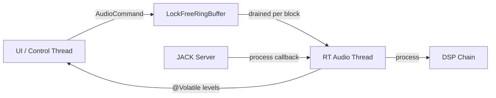
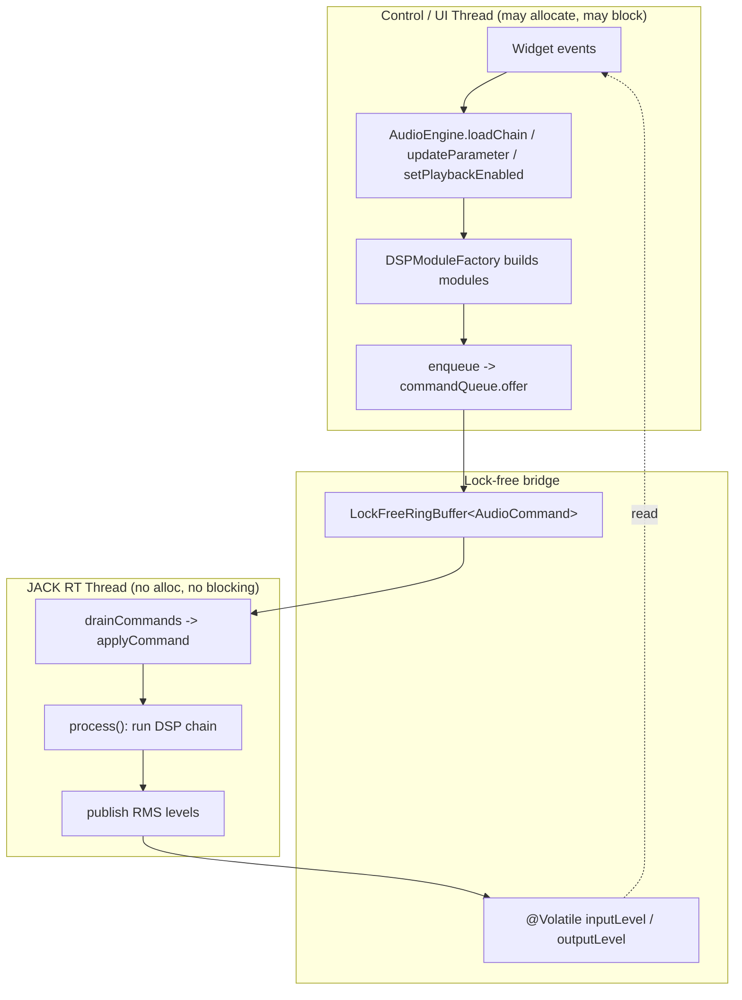
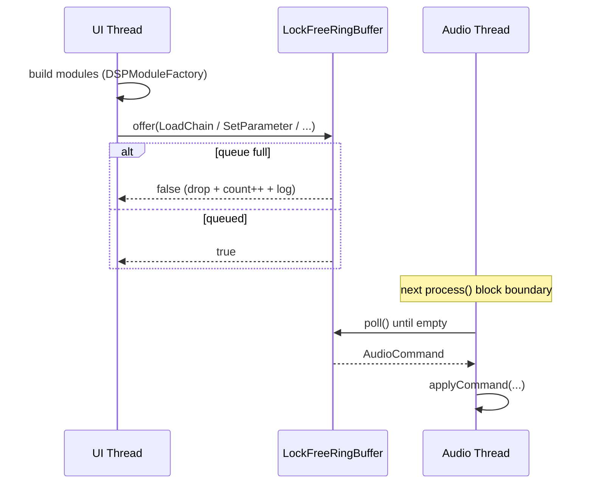
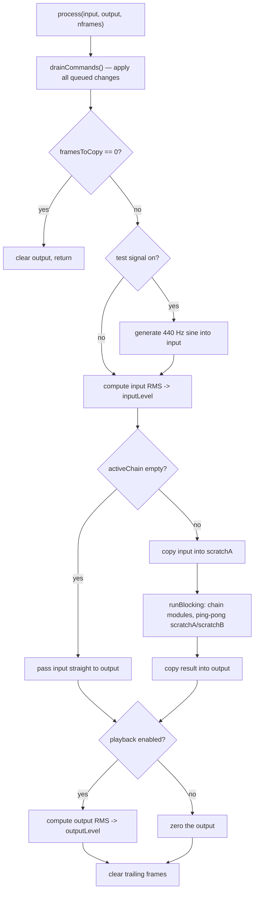
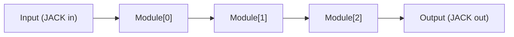
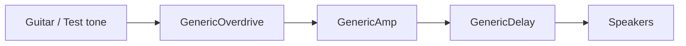
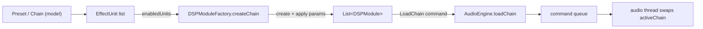

# Audio Engine & DSP Pipeline

This document describes how AmpChain turns an incoming audio stream into a
processed guitar tone: the real-time audio engine, its lock-free bridge to the
UI, and the DSP module pipeline that actually shapes the sound.

It is a companion to the [AmpChain Design Spec](AMPCHAIN_DESIGN_SPEC.md) and
reflects the current implementation under
`app/src/main/kotlin/org/ampsim/audio` and
`app/src/main/kotlin/org/ampsim/dsp`.

---

## Table of Contents

1. [Overview](#overview)
2. [Component Map](#component-map)
3. [Threading Model](#threading-model)
4. [The Command Queue](#the-command-queue)
5. [Real-Time Processing Loop](#real-time-processing-loop)
6. [DSP Pipeline](#dsp-pipeline)
7. [DSP Modules](#dsp-modules)
8. [From Model to Modules](#from-model-to-modules)
9. [Metering & Status](#metering--status)
10. [Real-Time Safety Rules](#real-time-safety-rules)
11. [Error Handling](#error-handling)
12. [Key Types Reference](#key-types-reference)

---

## Overview

The audio subsystem has one hard constraint: the **real-time audio thread must
never block and never allocate**. JACK calls back on a high-priority thread with
a fixed deadline (one audio block). Missing that deadline produces audible
glitches (xruns), so everything on that path is pre-allocated and wait-free.

To respect this, AmpChain splits work across two worlds:

- **Control/UI world** — builds DSP modules, reads presets, responds to widget
  events. Allowed to allocate and block.
- **Real-time world** — the JACK process callback. Only reads pre-built data,
  runs the DSP chain, and publishes meter levels.

The two communicate in one direction through a **lock-free command queue**, and
in the other direction through **`@Volatile` meter fields**. No locks are shared
between them.

---

## Component Map

| Component | File                          | Responsibility |
|-----------|-------------------------------|----------------|
| `AudioEngine` | `audio/AudioEngine.kt`        | Owns the JACK client, the command queue, the active chain, and the RT callback. |
| `JackClient` | `audio/JackClient.kt`         | Thin wrapper over JNAJack: opens/activates the client, registers ports, routes connections. |
| `LockFreeRingBuffer<T>` | `audio/LockFreeRingBuffer.kt` | SPSC wait-free queue used as the UI→audio command channel. |
| `AudioCommand` | `audio/AudioCommand.kt`       | Sealed set of messages the UI sends to the audio thread. |
| `AudioStatus` | `audio/AudioStatus.kt`        | Immutable snapshot of connection state + metering for the UI. |
| `DSPModule` | `dsp/DSPModule.kt`            | Contract every effect implements. |
| `BaseDSPModule` | `dsp/BaseDSPModule.kt`        | Shared parameter storage, state serialization, buffer validation. |
| `DSPModuleFactory` | `dsp/DSPModuleFactory.kt`     | Builds fully-initialized modules from model objects, off the audio thread. |
| `GenericOverdrive` / `GenericAmp` / `GenericDelay` | `dsp/effects/ Generic*.kt`    | The concrete placeholder effects. |
| `Chain` / `EffectUnit` | `model/*.kt`                  | Serializable description of a signal chain (the "what"). |

The **model** describes a chain declaratively; the **DSP layer** turns it into
runnable modules; the **audio layer** runs them in real time.

---

## Threading Model

Rules enforced by this split:

- Only the **control thread** calls `offer()` on the queue (single producer).
- Only the **audio thread** calls `poll()` on the queue (single consumer).
- The active chain (`activeChain`) is **owned exclusively by the audio thread**.
  The UI never mutates it directly; it swaps the whole list via a
  `LoadChain` command.
- Meter values flow back through plain `@Volatile` fields — cheap, lock-free
  reads for the UI.

---

## The Command Queue

`LockFreeRingBuffer<T>` is a **single-producer / single-consumer (SPSC)**
wait-free ring buffer. Its backing array is allocated once at construction, so
`offer` and `poll` never allocate and never block.

Key properties:

- Capacity is fixed (`COMMAND_QUEUE_CAPACITY = 256` for the command queue). One
  extra internal slot distinguishes "full" from "empty".
- `offer(item)` returns `false` when full — the item is **dropped**, never
  queued unboundedly. This keeps memory bounded even under a flood of UI events.
- Correctness relies on the volatile publish/subscribe ordering of the
  `head`/`tail` `AtomicInteger`s: the producer fills a slot, *then* publishes the
  new tail; the consumer reads the tail, *then* reads the slot.

When `offer` fails, `AudioEngine.enqueue` increments an `AtomicLong` counter and
logs a warning; the count is surfaced through `AudioStatus.droppedCommands`.

Because commands are only drained at the **start of a block**, every change
takes effect on a block boundary — never mid-block. This is the core mechanism
that avoids clicks and pops on parameter changes and chain swaps.

### Command Types

| Command | Meaning | Applied by |
|---------|---------|-----------|
| `LoadChain(modules)` | Replace the entire active chain with pre-built modules. | `activeChain = modules` |
| `SetParameter(index, name, value)` | Update one parameter of the module at `index`. Out-of-range index ignored. | `module.setParameter(...)` |
| `ResetChain` | Clear internal state (filters, delay lines) of all modules. | `module.reset()` for each |
| `SetPlayback(enabled)` | Mute/unmute output (metering keeps running). | toggles `rtPlaybackEnabled` |
| `SetTestSignal(enabled)` | Toggle the internal 440 Hz test tone. | toggles `rtTestSignalEnabled` |

---

## Real-Time Processing Loop

The JACK client is configured in `JackClient.open()` with a process callback that
fetches the input/output `FloatBuffer`s and delegates to
`AudioEngine.process(input, output, nframes)`. That method is the entire
real-time critical section.

Notable details:

- **`drainCommands()` runs first**, so the block is processed with the freshest
  UI state, and all effects land on the boundary.
- **Scratch buffers** (`scratchA`, `scratchB`) are pre-allocated to
  `DEFAULT_MAX_BLOCK = 8192` frames (and grown once at `start()` to at least the
  JACK buffer size). The chain "ping-pongs" between them so each module reads one
  buffer and writes the other — no per-module allocation.
- **`runBlocking` per block**: `DSPModule.process` is a `suspend` function, so the
  loop wraps the whole chain in a single `runBlocking`. The generic modules never
  actually suspend, so no coroutine dispatch or allocation happens per module.
- **Pass-through** when the chain is empty: input is copied straight to output.
- **Playback disabled** zeroes the output but still updates meters (output RMS
  will be 0), so the UI stays responsive.

---

## DSP Pipeline

Modules are chained **in series**: the output of one is the input to the next,
in list order. `AudioEngine` drives this with a two-buffer ping-pong so no
intermediate arrays are allocated.

A representative full-rig ordering (overdrive → amp → delay) as produced by the
legacy dashboard toggles:

Each module obeys the `DSPModule` contract:

- `process(input, output, nframes): Result<Unit>` — block processing; returns a
  failure `Result` if the buffers are too small or `nframes` is invalid (checked
  by `BaseDSPModule.validateBuffers`).
- `setParameter` / `getParameter` — parameters are clamped to their declared
  `ParameterInfo` range.
- `reset()` — clear filter/delay state to silence.
- `getState()` / `setState()` — serialize parameters to/from a `Map<String, Float>`.
- `getLatencySamples()` and `getCpuLoad()` — reporting hooks.

---

## DSP Modules

All three concrete modules extend `BaseDSPModule`, which stores parameter values
in a map keyed by name and falls back to each parameter's declared default. They
are **placeholders** for testing the pipeline, not models of specific hardware.

### GenericOverdrive (`type = "overdrive"`)

Signal path: drive gain → `tanh` soft-clip saturation → one-pole low-pass tone
control → output level.

| Parameter | Range | Default | Notes |
|-----------|-------|---------|-------|
| `drive` | 1–50 | 10 | Input gain into the saturator |
| `tone` | 0–1 | 0.5 | Blends filtered/unfiltered signal and sets filter coefficient |
| `level` | 0–1 | 0.7 | Output level |

State: one-pole low-pass accumulator (`lpState`), cleared on `reset()`.

### GenericAmp (`type = "amp"`)

Signal path: pre-gain → `tanh` saturation → 3-band tone stack (bass/mid/treble
via two one-pole crossovers) → master volume.

| Parameter | Range | Default | Notes |
|-----------|-------|---------|-------|
| `gain` | 1–100 | 20 | Pre-gain into saturation |
| `bass` | 0–2 | 1 | Low-band gain |
| `mid` | 0–2 | 1 | Mid-band gain |
| `treble` | 0–2 | 1 | High-band gain |
| `master` | 0–1 | 0.7 | Output level |

State: two one-pole crossover accumulators (`lowState`, `lowMidState`).

### GenericDelay (`type = "delay"`)

A single circular delay line with feedback and dry/wet mix. The delay buffer is
sized once for `MAX_DELAY_MS = 2000 ms`, so `process` never allocates.

| Parameter | Range | Default | Unit | Notes |
|-----------|-------|---------|------|-------|
| `time` | 1–2000 | 250 | ms | Delay time (converted to samples) |
| `feedback` | 0–0.95 | 0.3 | | Fraction fed back into the line |
| `mix` | 0–1 | 0.35 | | Dry/wet blend |

`getLatencySamples()` returns the current delay time in samples; the others
report 0.

---

## From Model to Modules

The model layer (`Chain`, `EffectUnit`) is a **serializable description** of a
rig. `DSPModuleFactory` converts it into runnable `DSPModule` instances **off the
audio thread**, so the audio thread only ever receives ready-to-run objects.

- `DSPModuleFactory.supportedTypes` = `{ "overdrive", "amp", "delay" }`.
- `create(type)` maps a type string to a fresh module; unknown types return
  `null`.
- `create(unit)` builds the module and applies each stored parameter.
- `createChain(chain)` maps the chain's **enabled** units to modules, **skipping
  unknown types** so a malformed preset can't break chain loading.

`AudioEngine.loadChain(chain)` runs the factory at the current sample rate, then
enqueues a single `LoadChain` command. The legacy dashboard toggles
(`setOverdriveEnabled` etc.) build their chain the same way via
`rebuildLegacyChain()`.

---

## Metering & Status

The audio thread computes **RMS** of the input (post test-signal) and output
each block and stores them in `@Volatile` `inputLevel` / `outputLevel` fields.
The UI reads them lock-free via `getInputLevel()` / `getOutputLevel()` /
`getVolume()`.

`AudioStatus` is an immutable snapshot assembled on demand by `updateStatus()`:

| Field | Source |
|-------|--------|
| `isConnected`, `sampleRate`, `bufferSize`, `cpuLoad`, `clientName` | `JackClient` |
| `inputLevel`, `outputLevel`, `activeModules` | audio thread meter/chain state |
| `droppedCommands` | dropped-command counter |
| `lastError` | last recorded error message |

Because metering uses `@Volatile` publication rather than a lock, the UI can poll
levels at frame rate without ever contending with the audio thread.

---

## Real-Time Safety Rules

These invariants are what keep the engine glitch-free. Preserve them when
extending the audio path:

1. **Never allocate on the audio thread.** All buffers (`scratchA/B`, delay
   lines, the ring buffer) are pre-allocated. Build new modules on the control
   thread and hand them over via `LoadChain`.
2. **Never block on the audio thread.** No locks, no I/O, no unbounded waits. The
   only synchronization is the wait-free queue and `@Volatile` fields.
3. **Single producer, single consumer.** Only the control thread `offer`s;
   only the audio thread `poll`s and owns `activeChain`.
4. **Apply changes on block boundaries.** All commands are drained at the top of
   `process()`, so parameter and chain changes never take effect mid-block.
5. **Bounded queues.** A full queue drops commands (and counts them) rather than
   growing without limit.
6. **Modules must be RT-friendly.** `process` must not allocate; stateful modules
   must implement `reset()` to clear buffers on `ResetChain`.

---

## Error Handling

- **JACK startup failures** are translated by `JackClient.open()` into a
  descriptive `Exception` (server not found / not started / connection failed).
  `AudioEngine.start()` catches it, records `lastError`, marks the status
  disconnected, and logs at `SEVERE`.
- **Device not found**: `setInputDevice()` checks the requested source against
  `availableInputSources()` and records a `lastError` (and warns) if it is
  missing, while still attempting routing with a sensible fallback.
- **Dropped commands**: surfaced via the counter + `AudioStatus.droppedCommands`
  and a warning log, so a UI event flood is observable rather than silent.
- **Invalid process buffers**: `BaseDSPModule.validateBuffers` returns a failure
  `Result` for negative frame counts or under-sized buffers instead of reading
  out of bounds.

Logging uses `java.util.logging.Logger` throughout the audio engine.

---

## Key Types Reference

| Type | Kind | Summary |
|------|------|---------|
| `AudioEngine` | class | Real-time engine; JACK callback, command draining, metering, lifecycle (`start`/`stop`). |
| `JackClient` | class | JNAJack wrapper: open/activate/close, port registration, routing, sample/buffer info. |
| `JackClient.AudioProcessor` | interface | `process(input, output, nframes)` callback contract implemented by `AudioEngine`. |
| `LockFreeRingBuffer<T>` | class | SPSC wait-free queue (`offer`/`poll`/`isEmpty`/`isFull`/`count`). |
| `AudioCommand` | sealed interface | `LoadChain`, `SetParameter`, `ResetChain`, `SetPlayback`, `SetTestSignal`. |
| `AudioStatus` | data class | Immutable state + metering snapshot for the UI. |
| `DSPModule` | interface | Effect contract: `process`, parameters, `reset`, state, latency/CPU. |
| `BaseDSPModule` | abstract class | Shared parameter map, state (de)serialization, buffer validation; `DEFAULT_SAMPLE_RATE = 48000`. |
| `DSPModuleFactory` | object | Builds modules from `EffectUnit`/`Chain` off the audio thread. |
| `ParameterInfo` | data class | Parameter metadata: `min`/`max`/`default`/`unit`, with `clamp`. |
| `Chain` / `EffectUnit` | data classes | Serializable declarative description of a rig. |
